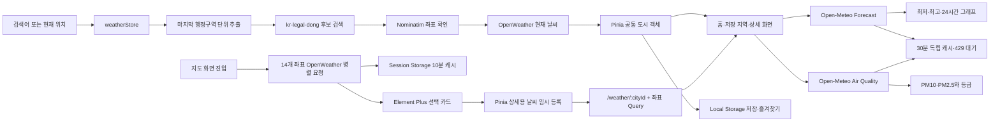

# WeatherNow

국내 행정구역 검색, 현재 위치, 저장·즐겨찾기, 전국 지도와 상세 예보를 하나의 흐름으로 연결한 Vue 3 기반 날씨 대시보드입니다.

SKALA Full-Stack Engineering 과정의 Vue.js 종합 과제로 제작했으며, 강의의 단계별 최소 요구사항을 모두 구현한 뒤 실제 서비스 형태로 기능과 UI를 확장했습니다.

배포:

> 최종 구현본 기준으로 국내 행정구역 검색, 현재 위치 저장·즐겨찾기, 상세 예보·대기질 캐시, 독도를 포함한 전국 지도와 반응형 UI까지 완성했습니다.

## 프로젝트 한눈에 보기

| 구분 | 내용 |
| --- | --- |
| 프레임워크 | Vue 3, Composition API, Vite |
| 상태 관리 | Pinia, Local Storage, Session Storage |
| 라우팅 | Vue Router, Lazy Loading, Dynamic Route, Catch-all Route |
| UI | Element Plus, 반응형 CSS Grid |
| 지도·그래프 | Leaflet, OpenStreetMap, SVG |
| 날씨 데이터 | OpenWeather Current Weather |
| 예보·대기질 | Open-Meteo Forecast / Air Quality |
| 지역 검색 | kr-legal-dong, Nominatim |
| 코드 품질 | Oxlint, Prettier, Vite Build |
| 배포 방식 | Vercel |
| 최종 검증 | Lint·Build 통과, 주요 사용자 흐름 브라우저 점검 |

## 핵심 사용자 흐름

1. 브라우저 위치 권한으로 현재 위치 날씨를 확인합니다.
2. 상위 경로를 제외한 마지막 국내 행정구역 단위를 이름·포함 문자열·초성으로 검색합니다.
3. 원하는 지역을 저장하고 홈에서 즐겨찾기만 빠르게 비교합니다.
4. 저장한 지역 페이지에서 권역, 이름, 추가 순서로 목록을 관리합니다.
5. 상세 페이지에서 현재 관측값, 오늘의 최저·최고 기온, 대기질과 24시간 추이를 확인합니다.
6. 전국 지도에서 독도를 포함한 주요 14개 지역을 비교하고 선택 지역의 상세 페이지로 이동합니다.

## 과제 최소 요구사항 충족 내역

강의자료의 단계별 과제를 그대로 보존한 실습 컴포넌트와, 이를 발전시킨 최종 애플리케이션을 함께 구성했습니다.

| 최소 요구사항 | 구현 내용 및 확인 위치 |
| --- | --- |
| `v-for`와 `:key`를 이용한 카드 반복 렌더링 | 날씨 배열을 `v-for`로 렌더링하고 도시 `id`를 key로 사용했습니다. [`WeatherMockup.vue`](src/components/exercise/WeatherMockup.vue) |
| `v-if` 조건부 렌더링 | 25℃ 이상/미만 라벨, 날씨 상태, 검색·선택 상태를 조건부로 표시했습니다. [`WeatherMockup.vue`](src/components/exercise/WeatherMockup.vue) |
| 한글 입력과 양방향 데이터 처리 | 한글 도시 검색값을 반응형 상태에 반영하고 화면에 출력했습니다. 최종 검색창에서는 한글 조합 중인 값도 처리합니다. [`WeatherMockup.vue`](src/components/exercise/WeatherMockup.vue), [`SearchBar.vue`](src/components/exercise/SearchBar.vue) |
| 카드 선택과 이벤트 버블링 방지 | 카드 선택 이벤트와 내부 상세 버튼을 분리하고 `@click.stop`을 적용했습니다. [`WeatherMockup.vue`](src/components/exercise/WeatherMockup.vue), [`WeatherCard.vue`](src/components/exercise/WeatherCard.vue) |
| `ref`, `computed`, `watch`, `watchEffect` 활용 | 검색어·도시·필터 상태를 반응형으로 관리하고 계산된 검색 결과와 상태 감시 로직을 구현했습니다. [`WeatherComposition.vue`](src/components/exercise/WeatherComposition.vue) |
| 검색 결과·빈 결과 분기 | 검색어가 없을 때 전체 목록, 일치할 때 필터 목록, 없을 때 빈 결과 안내를 표시합니다. 최종 화면에서는 저장 결과와 API 검색 결과도 분리했습니다. [`WeatherComposition.vue`](src/components/exercise/WeatherComposition.vue), [`WeatherHomeView.vue`](src/views/WeatherHomeView.vue) |
| 4개 이상의 컴포넌트 분리 | 화면 조합, 공통 카드, 검색창, 날씨 카드를 각각 분리했습니다. [`WeatherParent.vue`](src/components/exercise/WeatherParent.vue), [`BaseDashboardCard.vue`](src/components/exercise/BaseDashboardCard.vue), [`SearchBar.vue`](src/components/exercise/SearchBar.vue), [`WeatherCard.vue`](src/components/exercise/WeatherCard.vue) |
| Props, Emits, Slot, Scoped Style | 검색어와 도시 객체는 props로 받고 선택·상세·즐겨찾기 이벤트는 emits로 전달합니다. 공통 카드에 slot을 사용하고 컴포넌트 스타일은 scoped로 관리합니다. |
| Lazy Loading과 Catch-all Route | 모든 View를 동적 import하고 정의되지 않은 주소는 404 화면으로 연결했습니다. [`router/index.js`](src/router/index.js) |
| Navigation Bar와 `RouterView` | 공통 헤더에 `RouterLink`, 본문에 `RouterView`를 배치했습니다. [`App.vue`](src/App.vue) |
| Programmatic Navigation | 상세 버튼에서 `router.push()`로 `/weather/:cityId`에 이동합니다. [`WeatherHomeView.vue`](src/views/WeatherHomeView.vue) |
| 동적 상세·소개 페이지 | 도시 ID 기반 상세 화면, 서비스 소개, 프로젝트 소개와 404 화면을 구현했습니다. [`WeatherDetailView.vue`](src/views/WeatherDetailView.vue), [`WeatherAboutView.vue`](src/views/WeatherAboutView.vue), [`WeatherProjectView.vue`](src/views/WeatherProjectView.vue) |
| 온도 단위 Store | `unit` state, 단위 관련 getters, 섭씨·화씨 전환 actions를 구현하고 Local Storage에 유지합니다. [`configStore.js`](src/stores/configStore.js) |
| 상단 단위 전환 UI | Navigation 옆에 단위 버튼을 배치하고 홈·상세·지도에 동일한 단위를 적용했습니다. [`UnitToggle.vue`](src/components/exercise/UnitToggle.vue), [`useTemperature.js`](src/composables/useTemperature.js) |
| Axios와 OpenWeather 연동 | Mock Data를 넘어 좌표 기반 OpenWeather 현재 날씨를 조회하고 로딩·오류 상태를 처리합니다. [`weatherStore.js`](src/stores/weatherStore.js) |
| Element Plus 적용 | Input, Button, Select, Option, Tag, Alert, Skeleton, Empty, Card, Statistic, Descriptions, Icon, Message, MessageBox를 사용했습니다. 자동 import 설정은 [`vite.config.js`](vite.config.js), 공통 테마는 [`common.css`](src/assets/common.css)에서 확인할 수 있습니다. |
| 메뉴와 활용 API 추가 | 저장한 지역·프로젝트 소개 메뉴를 추가하고 Open-Meteo, Nominatim, kr-legal-dong, Leaflet/OSM을 결합했습니다. |
| ESLint 오류 제거 | `npm run lint`로 ESLint와 Oxlint를 모두 통과합니다. |
| API 키 환경 변수 처리 | 실제 `.env`는 Git에서 제외하고 `.env.example`에는 변수명과 예시만 제공합니다. [`.env.example`](.env.example), [`.gitignore`](.gitignore) |
| 프로덕션 빌드·호스팅 | `npm run build`로 `dist` 정적 파일을 생성하며 Vercel에 배포할 수 있습니다. |

## 기본 요구사항 이상으로 구현한 기능

### 1. 국내 행정구역 중심 검색

- 시·도, 시·군·구, 읍·면·동 데이터를 이용한 국내 전용 검색
- `발산`으로 `내발산동`을 찾는 포함 문자열 검색
- `ㄴㅂㅅㄷ`과 같은 초성 검색
- `서울특별시 강서구 → 강서구`처럼 상위 경로를 제외한 마지막 지역 단위만 검색
- 건물, 학교, 도로 등 날씨 지역으로 부적절한 POI 제외
- 상위 행정구역 우선 정렬 및 최대 5개 결과 표시
- 저장된 지역은 API 호출 없이 즉시 검색
- 새 지역은 두 글자 이상 입력 후 Enter 또는 검색 버튼으로 명시적으로 요청
- 한글 IME 조합 중 두 번째 글자에서 버튼이 갱신되지 않던 문제 보완

### 2. 현재 위치 날씨

- Geolocation API를 이용한 현재 좌표 조회
- Nominatim 역지오코딩으로 실제 동네 이름과 상위 행정구역 표시
- 위치 권한 거부·미지원·시간 초과 시 서울 날씨와 안내 메시지 제공
- 위치 확인 중 실제 카드와 같은 높이의 로딩 카드 표시
- 현재 위치 카드는 항상 유지하고 삭제는 제한
- 현재 확인된 지역을 일반 저장 지역으로 복사해 위치가 바뀐 뒤에도 관리 가능
- 현재 위치도 즐겨찾기에 추가하여 홈과 저장 지역에서 확인 가능

### 3. 저장 지역과 즐겨찾기 역할 분리

- 홈에는 현재 위치와 즐겨찾기 지역만 간결하게 표시
- 저장한 지역 페이지에는 전체 저장 목록 표시
- 즐겨찾기 도시 우선 배치
- 수도권·충청권·경상권·강원권 등 국내 권역 필터
- 추가순·가나다순과 오름차순·내림차순 조합 정렬
- Element Plus MessageBox 기반 삭제 확인
- 삭제 모달에 50% 검정 오버레이와 위험 버튼 스타일 적용

### 4. 상세 날씨와 대기질

- 현재 기온, 체감 기온, 오늘 최저·최고 기온
- 습도, 풍속, 가시거리
- PM10·PM2.5 값과 좋음·보통·나쁨·매우 나쁨 등급
- 선택 지역명과 상위 행정구역을 함께 표시
- 예보와 대기질 요청을 `Promise.allSettled`로 분리하여 부분 실패 허용
- 예보·대기질을 각각 Session Storage에 30분 캐시하고 429 발생 시 재요청 대기
- 갱신 실패 시 최대 6시간 이내의 이전 성공 데이터를 경고와 함께 표시

### 5. 24시간 날씨 추이 그래프

- 표 대신 SVG 선 그래프로 기온·습도·강수량 표현
- 기온은 주황색, 강수량은 파란색으로 구분
- 시간 지점을 선택하면 상세 수치 갱신
- Open-Meteo `is_day` 값을 이용한 주간 해·야간 달 아이콘
- 일출·일몰을 해·달 마커와 시각으로 같은 시간축에 표시

### 6. 전국 날씨 지도

- Leaflet과 OpenStreetMap으로 대한민국 지도 구성
- 서울, 부산, 제주, 울릉도, 독도 등 주요 14개 지역 표시
- Element Plus Card·Statistic·Descriptions 기반의 선택 지역 요약 제공
- 선택한 지도 날씨를 Pinia에 임시 등록하여 추가 API 요청 없이 상세 페이지로 이동
- 도시 ID·지역명·좌표 Query를 함께 전달해 상세 URL 직접 접근과 새로고침 복원
- Leaflet 지도와 상세 버튼의 마우스·포인터·터치 이벤트 전파 분리
- `IntersectionObserver`로 지도 진입 시점에 데이터 지연 요청
- 일부 도시 요청 실패 시 성공한 도시만 계속 표시
- Session Storage에 10분간 캐시하여 중복 API 호출 감소

### 7. 사용성과 접근성

- PC 2열, 태블릿·모바일 1열 반응형 대시보드
- 로딩, 빈 결과, 권한 거부, API 실패를 사용자 문장으로 안내
- 명확한 버튼 문구와 `aria-label`, `aria-pressed`, live region 적용
- 키보드 Enter 검색과 페이지 이동 후 본문 초점 처리
- 서비스 이용 메뉴와 개발 문서인 프로젝트 소개 메뉴를 시각적으로 구분
- 긴 프로젝트 설명은 목차 버튼으로 필요한 내용만 전환

## 기술 선택

| 기술 | 적용 이유 |
| --- | --- |
| Vue 3 Composition API | 상태와 파생값을 기능 단위로 구성하고 재사용하기 위해 사용했습니다. |
| Pinia | 날씨 목록, 현재 위치, 검색 결과, 즐겨찾기와 단위 설정을 여러 화면에서 공유합니다. |
| Vue Router | 정적 페이지와 `/weather/:cityId` 동적 상세 페이지를 SPA 안에서 연결합니다. |
| Axios | 외부 API 요청, 쿼리 파라미터, 타임아웃과 오류 처리를 일관되게 관리합니다. |
| Element Plus | 입력, 피드백, 로딩, 확인 UI와 지도 선택 지역의 카드·통계·설명 표현을 일관되게 구성합니다. |
| Leaflet | 독도를 포함한 주요 14개 지역 마커와 상세 화면으로 연결되는 상호작용형 전국 지도를 구성합니다. |
| SVG | 별도 차트 라이브러리 없이 프로젝트에 필요한 시간별 그래프를 직접 표현합니다. |

## API와 데이터 소스

| 데이터 소스 | 사용 목적 |
| --- | --- |
| OpenWeather Current Weather | 현재·체감 기온, 습도, 풍속, 가시거리, 날씨 상태와 아이콘 |
| Open-Meteo Forecast | 오늘 최저·최고 기온, 24시간 기온·습도·강수량, 일출·일몰, 주·야간 상태 |
| Open-Meteo Air Quality | PM10과 PM2.5 현재값 |
| CAMS ENSEMBLE / 에어코리아 기준 | 대기질 데이터 출처와 국내 등급 분류 기준 |
| kr-legal-dong | 국내 시·도, 시·군·구, 읍·면·동 검색 후보 |
| Nominatim / OpenStreetMap | 검색 후보 좌표 확인과 현재 위치 역지오코딩 |
| Leaflet / OSM Tiles | 전국 날씨 지도 렌더링 |

## 데이터 흐름



### 저장 전략

| 저장 위치 | 데이터 |
| --- | --- |
| Pinia | 현재 화면의 날씨 목록, 현재 위치, 검색·로딩·오류 상태와 지도 상세용 임시 날씨 |
| Local Storage | 저장 지역, 즐겨찾기 ID, 온도 단위, 검색·역지오코딩 캐시 |
| Session Storage | 전국 14개 지역 날씨 10분 캐시, 예보·대기질 각각 30분 캐시, 429 재요청 대기 시각 |
| Route Param · Query | 상세 도시 ID와 전국 지도에서 선택한 지역명·상위 지역·좌표 |

## 주요 파일 구조

```text
src/
├── views/
│   ├── WeatherHomeView.vue          # 현재 위치·검색·즐겨찾기·전국 지도
│   ├── WeatherFavoritesView.vue     # 저장 지역 필터·정렬·삭제
│   ├── WeatherDetailView.vue        # 현재 관측·대기질·시간별 예보·지도 좌표 복원
│   ├── WeatherAboutView.vue         # 서비스 소개
│   ├── WeatherProjectView.vue       # 포트폴리오용 프로젝트 문서
│   └── NotFoundView.vue             # Catch-all 404
├── components/exercise/
│   ├── BaseDashboardCard.vue        # 공통 카드와 slot
│   ├── SearchBar.vue                # 검색 입력과 submit 이벤트
│   ├── WeatherCard.vue              # 날씨 요약·상세·저장·즐겨찾기·삭제 이벤트
│   ├── UnitToggle.vue               # 섭씨·화씨 전환
│   ├── KoreaWeatherMap.vue          # Leaflet 지도·Element Plus 요약·상세 이동
│   ├── HourlyWeatherForecast.vue    # SVG 시간별 그래프
│   ├── WeatherMockup.vue            # Vue 문법 단계 과제
│   ├── WeatherComposition.vue       # Composition API 단계 과제
│   └── WeatherParent.vue            # Component 단계 과제
├── stores/
│   ├── weatherStore.js              # 날씨·검색·위치·저장·즐겨찾기·상세용 임시 상태
│   └── configStore.js               # 온도 단위 설정
├── composables/
│   ├── useTemperature.js            # 공통 온도 변환·표시
│   └── useWeatherSupplement.js      # 예보·대기질 병렬 요청과 캐시
├── utils/
│   ├── getChosung.js                # 한글 초성 변환
│   ├── getRepresentativeLocationName.js # 마지막 행정구역 단위 추출
│   ├── getWeatherRegion.js          # 국내 권역 분류
│   └── getWeatherIconUrl.js         # 날씨 아이콘 URL
├── data/koreaWeatherLocations.js    # 독도 포함 전국 14개 지역 좌표
├── router/index.js                  # Lazy·Dynamic·Catch-all Route
├── assets/common.css                # 공통 UI와 Element Plus 커스텀
├── App.vue                          # 공통 헤더·Navigation·RouterView
└── main.js                          # Pinia·Router 등록
```

## 실행 방법

### 요구 환경

- Node.js `^22.18.0` 또는 `>=24.12.0`
- npm
- OpenWeather API Key

### 1. 저장소 복제

```bash
git clone https://github.com/dlkara/skala-vue.git
cd skala-vue
```

### 2. 의존성 설치

```bash
npm install
```

### 3. 환경 변수 설정

```bash
cp .env.example .env
```

`.env`의 OpenWeather 키를 본인의 값으로 변경합니다.

```dotenv
VITE_OPENWEATHER_API_KEY=YOUR_OPENWEATHER_API_KEY
```

나머지 URL은 `.env.example`의 기본 공개 데이터 주소를 그대로 사용할 수 있습니다.

### 4. 개발 서버 실행

```bash
npm run dev
```

기본 접속 주소는 `http://localhost:5173`입니다.

## 명령어

| 명령어 | 설명 |
| --- | --- |
| `npm run dev` | Vite 개발 서버 실행 |
| `npm run lint` | Oxlint와 ESLint 검사 및 자동 수정 |
| `npm run format` | Prettier 형식 적용 |
| `npm run build` | 프로덕션 정적 파일을 `dist`에 생성 |
| `npm run preview` | 빌드 결과 로컬 미리보기 |

## Vercel 배포

1. GitHub 저장소를 Vercel에 Import합니다.
2. Framework Preset은 `Vite`를 선택합니다.
3. 환경 변수에 `VITE_OPENWEATHER_API_KEY`를 등록합니다.
4. Build Command는 `npm run build`, Output Directory는 `dist`를 사용합니다.
5. Production Branch에 변경사항을 push하면 자동으로 재배포됩니다.

저장소의 `vercel.json`에는 Vue Router의 history 경로를 직접 열거나 새로고침해도 `index.html`로 연결되도록 다음 rewrite가 포함되어 있습니다.

```json
{
  "rewrites": [
    {
      "source": "/(.*)",
      "destination": "/index.html"
    }
  ]
}
```

## 오류·실패 처리

- OpenWeather API 키 누락과 인증 오류
- API 요청 시간 초과와 네트워크 오류
- 위치 권한 거부·미지원·시간 초과
- 검색 결과 없음과 잘못된 좌표
- 예보 또는 대기질 중 일부 요청만 실패한 경우
- Open-Meteo 429 응답과 재요청 대기, 이전 성공 데이터 대체 표시
- 전국 지도 일부 지역 요청 실패
- Leaflet 지도와 상세 버튼의 포인터·터치 이벤트 충돌
- Local/Session Storage 접근 실패
- 존재하지 않는 상세 도시 ID와 Catch-all 경로

## 보안 참고

- 실제 `.env` 파일은 `.gitignore`에 포함되어 GitHub에 업로드되지 않습니다.
- `VITE_` 접두사의 환경 변수는 빌드 후 브라우저 코드에 포함됩니다.
- 현재 구조는 프런트엔드 학습 과제에 맞춘 구성입니다.
- 운영 서비스에서는 OpenWeather 요청을 Serverless Function 또는 BFF로 이동해 API 키를 보호해야 합니다.

## 제출 전 체크리스트

- [x] 강의자료의 Vue 문법·Composition API·Component 최소 요구사항 구현
- [x] Vue Router Lazy Loading·Dynamic Route·Catch-all Route 구현
- [x] Pinia 온도 단위 Store와 홈·상세 화면 연동
- [x] Axios·OpenWeather 실데이터 연동
- [x] Element Plus 입력·피드백·모달·카드·통계·설명 UI 적용
- [x] 추가 메뉴와 복수 API를 이용한 기능 확장
- [x] 마지막 행정구역 단위 기반 부분·초성 검색 구현
- [x] 현재 위치 저장·즐겨찾기와 저장 지역 관리 구현
- [x] Forecast·대기질 독립 캐시와 429 대응 구현
- [x] 독도를 포함한 전국 14개 지역 지도와 새로고침 가능한 상세 이동 구현
- [x] `.env` Git 제외 및 `.env.example` 제공
- [x] `npm run lint` 통과
- [x] `npm run build` 통과
- [ ] GitHub 저장소가 Public인지 시크릿 창에서 최종 확인
- [ ] Vercel 재배포 후 제출용 URL 확인
